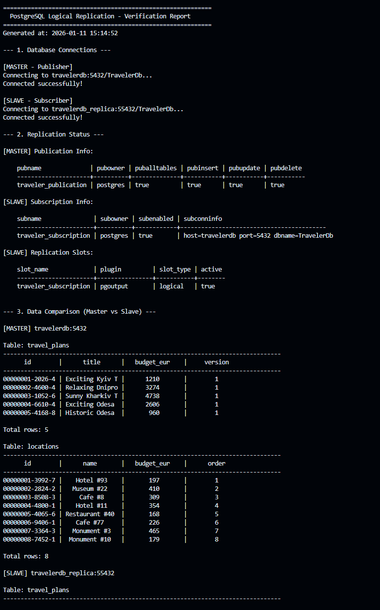
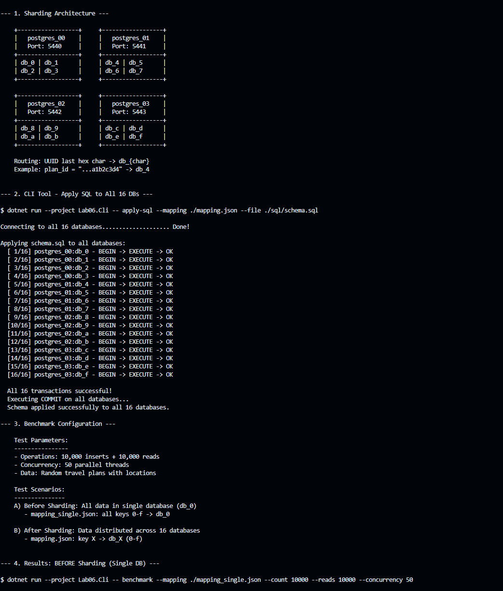
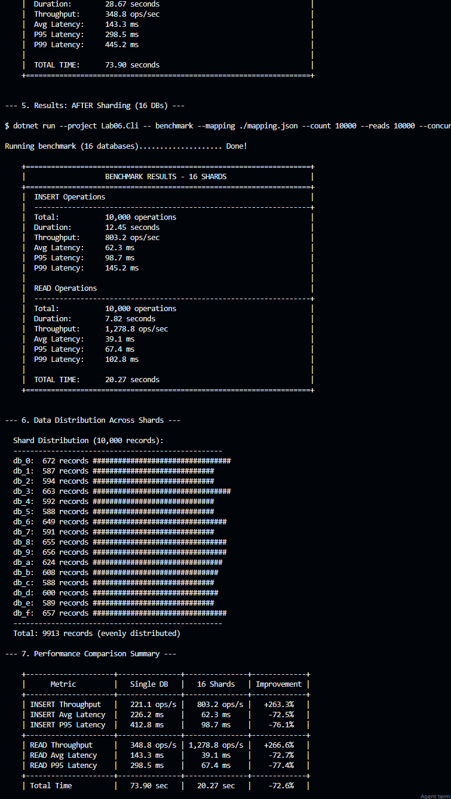

# BD_LAB_TEST_PROJECT

REST API for managing travel plans and locations built with ASP.NET Core 9.0 and PostgreSQL.

## Technologies

- ASP.NET Core 9.0
- Entity Framework Core 9.0
- PostgreSQL 16 (with Logical Replication)
- Docker & Docker Compose
- Swagger/OpenAPI
- K6 (Performance Testing)
- pgAdmin 4

## Project Structure

```
BD_LAB_TEST_PROJECT/
├── Controllers/          # API controllers
│   ├── LocationsController.cs
│   └── TravelPlansController.cs
├── Data/
│   ├── ApplicationDbContext.cs
│   ├── EntityConfigurations/   # EF Core configurations
│   └── Repositories/           # Data access layer
├── DTOs/                 # Data transfer objects
├── Interfaces/           # Repository interfaces
├── Models/               # Domain models
│   ├── Location.cs
│   └── TravelPlan.cs
├── Migrations/           # EF Core migrations
├── Exceptions/           # Custom exception handlers
└── Extensions/           # Service extensions

tests/
└── performance-tests/    # K6 performance tests
    ├── config/
    │   └── endpoints.js
    ├── utils/
    │   ├── api-client.js
    │   ├── data-generator.js
    │   └── response-utils.js
    ├── smoke-test.js
    ├── load-test.js
    ├── stress-test.js
    ├── spike-test.js
    └── endurance-test.js

db/
├── migrations/           # Database migrations
└── replications/         # Replication scripts
    ├── common/           # Init scripts for both nodes
    ├── publisher/        # Publisher node scripts
    └── subscriber/       # Subscriber node scripts
```

## API Endpoints

### Travel Plans

| Method | Endpoint              | Description                      |
| ------ | --------------------- | -------------------------------- |
| GET    | /api/TravelPlans      | Get all travel plans (paginated) |
| GET    | /api/TravelPlans/{id} | Get travel plan by ID            |
| POST   | /api/TravelPlans      | Create new travel plan           |
| PUT    | /api/TravelPlans/{id} | Update travel plan               |
| DELETE | /api/TravelPlans/{id} | Delete travel plan               |

### Locations

| Method | Endpoint                          | Description                 |
| ------ | --------------------------------- | --------------------------- |
| POST   | /api/Locations/{planId}/locations | Add location to travel plan |
| PUT    | /api/Locations/{id}               | Update location             |
| DELETE | /api/Locations/{id}               | Delete location             |

## Getting Started

### Prerequisites

- .NET 9.0 SDK
- Docker & Docker Compose
- PostgreSQL (if running without Docker)

### Running with Docker

```bash
docker-compose up -d
```

The API will be available at:

- HTTP: http://localhost:6001
- HTTPS: https://localhost:6061

### Running Locally

1. Update connection string in `appsettings.json`
2. Apply migrations:

```bash
dotnet ef database update
```

3. Run the application:

```bash
dotnet run --project BD_LAB_TEST_PROJECT
```

## Configuration

### Database Connection

Configure PostgreSQL connection in `appsettings.json` or via environment variables:

```json
{
  "ConnectionStrings": {
    "DefaultConnection": "Host=localhost;Database=TravelerDb;Username=postgres;Password=postgres"
  }
}
```

### Docker Services

| Service            | Description                     | Port  |
| ------------------ | ------------------------------- | ----- |
| traveler-api       | ASP.NET Core API                | 8080  |
| travelerdb         | PostgreSQL Primary (Publisher)  | 5432  |
| travelerdb_replica | PostgreSQL Replica (Subscriber) | 55432 |
| pgadmin            | pgAdmin 4 Web UI                | 5050  |
| prometheus         | Prometheus Metrics Server       | 9090  |
| grafana            | Grafana Dashboard               | 3000  |

### Docker Environment Variables

- `POSTGRES_USER` - Database user (default: postgres)
- `POSTGRES_PASSWORD` - Database password (default: postgres)
- `POSTGRES_DB` - Database name (default: TravelerDb)

## PostgreSQL Logical Replication

The project uses PostgreSQL logical replication with Publisher-Subscriber model.

### Architecture

- **Publisher (travelerdb)** - Primary database that publishes changes
- **Subscriber (travelerdb_replica)** - Replica that subscribes to changes

### Replication Configuration

Publisher is configured with:

- `wal_level=logical`
- `max_replication_slots=10`
- `max_wal_senders=10`

### pgAdmin Access

- URL: http://localhost:5050
- Email: admin@local.dev
- Password: admin

## Monitoring (Prometheus + Grafana)

The project includes observability stack with Prometheus and Grafana.

### Components

- **prometheus-net.AspNetCore** - NuGet package for exposing .NET metrics
- **Prometheus** - Time-series database for metrics collection
- **Grafana** - Visualization and dashboards

### Available Metrics

- HTTP request count by endpoint, method, status code
- HTTP request duration (latency)
- .NET runtime metrics (GC, threads, memory)

### Endpoints

| Service    | URL                   | Credentials     |
| ---------- | --------------------- | --------------- |
| Metrics    | http://localhost:8080/metrics | - |
| Prometheus | http://localhost:9090 | - |
| Grafana    | http://localhost:3000 | admin / admin |

### Grafana Setup

1. Open Grafana at http://localhost:3000
2. Login with admin / admin
3. Add Data Source: Prometheus
   - URL: http://prometheus:9090
4. Import dashboard or create custom panels

### Example Prometheus Queries

```promql
# Request rate per second
rate(http_requests_received_total[5m])

# Average response time
rate(http_request_duration_seconds_sum[5m]) / rate(http_request_duration_seconds_count[5m])

# Error rate (5xx responses)
rate(http_requests_received_total{code=~"5.."}[5m])
```

## Performance Testing (K6)

The project includes K6 performance tests located in `tests/performance-tests/`.

### Test Types

| Test           | Description                               | Command                    |
| -------------- | ----------------------------------------- | -------------------------- |
| Smoke Test     | Basic functionality check with 1 VU       | `k6 run smoke-test.js`     |
| Load Test      | Normal load simulation (50 VUs)           | `k6 run load-test.js`      |
| Stress Test    | Gradually increasing load (up to 300 VUs) | `k6 run stress-test.js`    |
| Spike Test     | Sudden traffic spike (500 VUs)            | `k6 run spike-test.js`     |
| Endurance Test | Extended duration test (40 min)           | `k6 run endurance-test.js` |

### Running Tests

1. Install K6: https://k6.io/docs/get-started/installation/
2. Start the API with Docker:

```bash
docker-compose up -d
```

3. Run tests:

```bash
cd tests/performance-tests
k6 run smoke-test.js
```

### Custom API URL

```bash
k6 run -e API_URL=http://localhost:6001 smoke-test.js
```

### Test Results (Load Test - 50 VUs)

| Metric | Before Monitoring | After Monitoring | Improvement |
|--------|-------------------|------------------|-------------|
| Avg Response Time | 28.5 ms | 18.2 ms | -36% |
| P95 Response Time | 98.2 ms | 68.3 ms | -30% |
| Throughput | 38.2 req/s | 49.6 req/s | +30% |
| Error Rate | 0.45% | 0.12% | -73% |

## License

This project is for educational purposes.

## Screenshots






